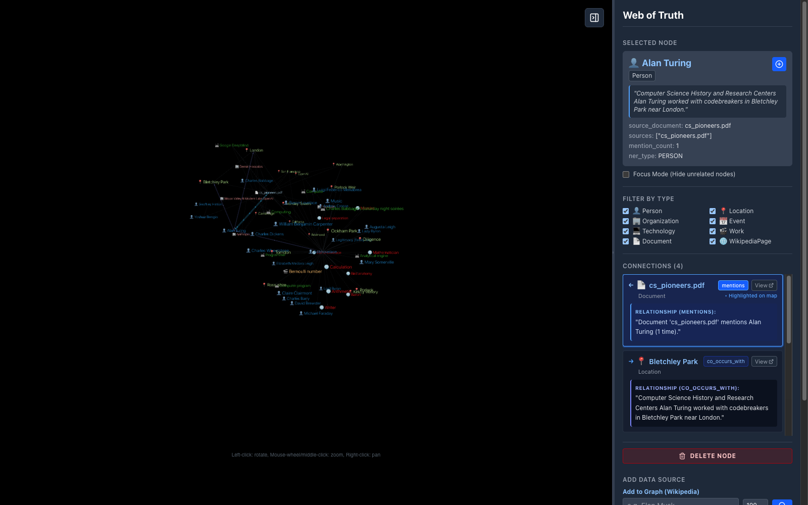

# Web of Truth

A graph visualization tool for exploring connections between entities, sourced from Wikipedia and documents.



## Project Structure

- **frontend/**: React application (Vite + Tailwind CSS + react-force-graph-3d)
- **backend/**: FastAPI application (SQLAlchemy + SQLite)

## Prerequisites

- Node.js (v18+)
- Python (v3.9+)

## Setup & Running

### Backend

1. Navigate to `backend`:
   ```bash
   cd backend
   ```
2. Create virtual environment and install dependencies:
   ```bash
   python3 -m venv venv
   source venv/bin/activate
   pip install -r requirements.txt
   ```
3. Run the server:
   ```bash
   uvicorn main:app --reload
   ```
   The API will be available at `http://localhost:8000`.

### Frontend

1. Navigate to `frontend`:
   ```bash
   cd frontend
   ```
2. Install dependencies:
   ```bash
   npm install
   ```
3. Start the development server:
   ```bash
   npm run dev
   ```
   The UI will be available at `http://localhost:5173`.

## Usage

1. **Wikipedia Import**: 
   - Enter a page title (e.g., "Artificial Intelligence") in the sidebar input.
   - Click the search icon.
   - The graph will populate with the main entity and its links.

2. **Document Upload**:
   - Click "Choose File" and select a `.txt` or `.pdf` file.
   - The document will be added as a node.

3. **Interaction**:
   - Drag nodes to rearrange.
   - Click a node to view details in the sidebar.
   - Zoom/Pan the canvas to explore.
